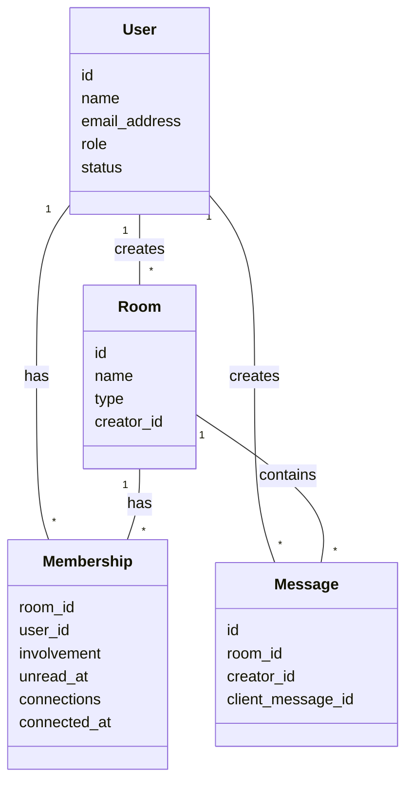

## データモデル

app/models/room.rb (ルームの基本定義)

app/models/message.rb (メッセージ の定義)

app/models/membership.rb (ユーザーとルームの関連)

## ルームの種類

routes.rb から3種類のルームがあることがわかる

| 種類 | パス | 詳細 |
|---|---|---|
| Opens | rooms/opens | 公開ルーム |
| Closeds | rooms/closeds | 非公開ルーム |
| Directs | rooms/directs | ダイレクトメッセージ |

対応するコントローラは以下

- app/controllers/rooms/opens_controller.rb
- app/controllers/rooms/closeds_controller.rb
- app/controllers/rooms/directs_controller.rb

ルームのアクションを定義しているコントローラは以下

app/controllers/rooms_controller.rb（ルームの表示）

app/controllers/messages_controller.rb（メッセージの CRUD）

## リアルタイム機能

app/channels (Action Cable)

app/models/room/message_pusher.rb (Push 通知)

## ビュー

app/views/rooms/show.html.erb (ルーム画面)

app/views/rooms/show/_composer.html.erb (メッセージ入力欄)

app/views/messages/ (メッセージ表示)

