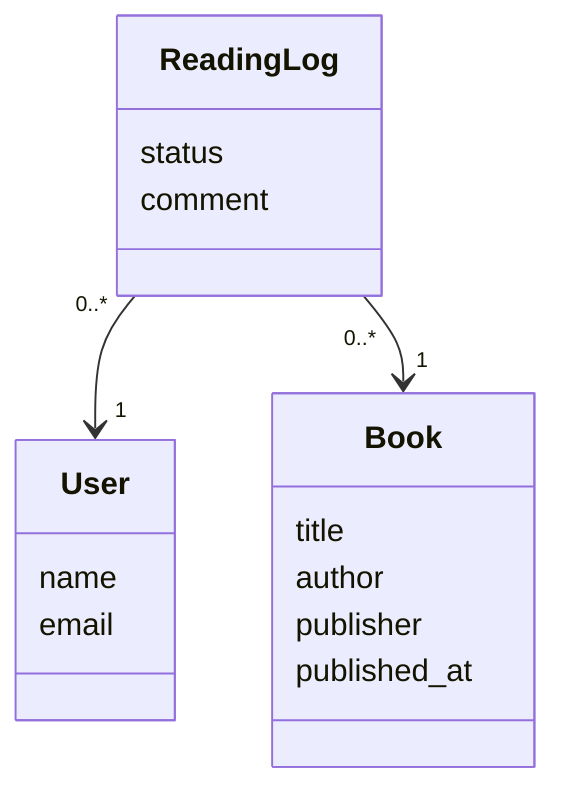

```mermaid
classDiagram
    class Book {
        title
        author
        publisher
        published_at
    }

    class ReadingLog {
        status
        comment
    }

    class User {
        name
        email
    }

    ReadingLog "0..*" --> "1" User
    ReadingLog "0..*" --> "1" Book
```
