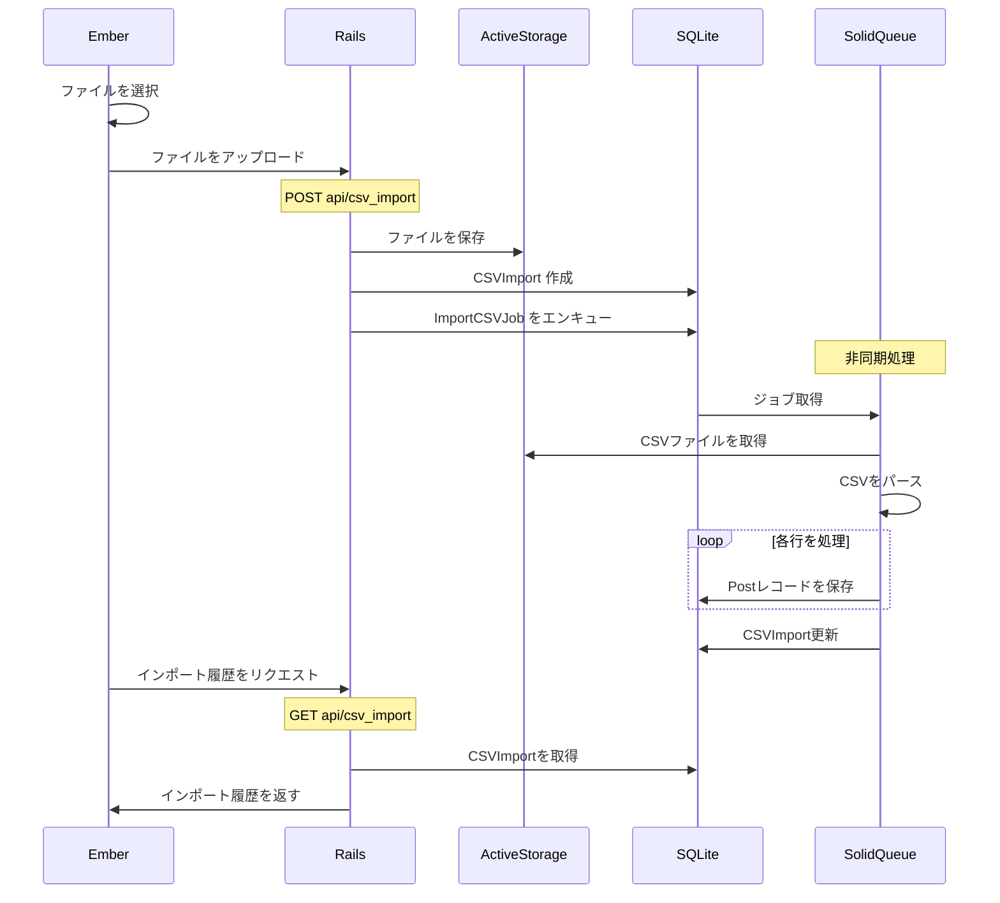
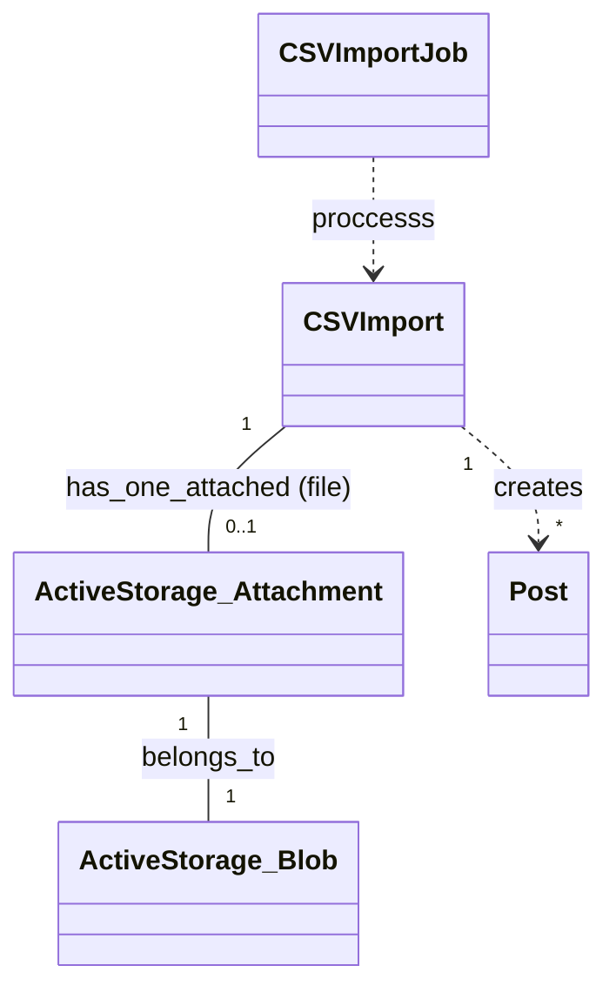

# ブログへの　CSV インポート機能の実装

## 要件

1行に日付とタイトルと本文を入れて1エントリ、それをファイル単位でまとめて管理画面からインポートできる（非同期で）。
管理画面でインポート履歴（成功N件/失敗M件）が見られる。

### 日付の扱い
`published_at` カラムを追加する

### 処理の流れ

```mermaid
sequenceDiagram
  Ember->>Ember: ファイルを選択
  Ember->>Rails: ファイルをアップロード
  Note over Rails: POST api/csv_import
  Rails->>ActiveStorage: ファイルを保存
  Rails->>SQLite: CSVImport 作成
  Rails->>SQLite: ImportCSVJob をエンキュー
  
  Note over SolidQueue: 非同期処理
  SQLite->>SolidQueue: ジョブ取得
  SolidQueue->>ActiveStorage: CSVファイルを取得
  SolidQueue->>SolidQueue: CSVをパース
  loop 各行を処理
    SolidQueue->>SQLite:Postレコードを保存
  end
  SolidQueue->>SQLite: CSVImport更新
  
  Ember->>Rails: インポート履歴をリクエスト
  Note over Rails: GET api/csv_import
  Rails->>SQLite: CSVImportを取得
  Rails->>Ember: インポート履歴を返す
```

```mermaid
classDiagram
  CSVImport "1" -- "0..1" ActiveStorage_Attachment : has_one_attached (file)
  ActiveStorage_Attachment "1" -- "1" ActiveStorage_Blob : belongs_to
  CSVImport "1" ..> "*" Post : creates
  CSVImportJob ..> CSVImport :proccesss
```
