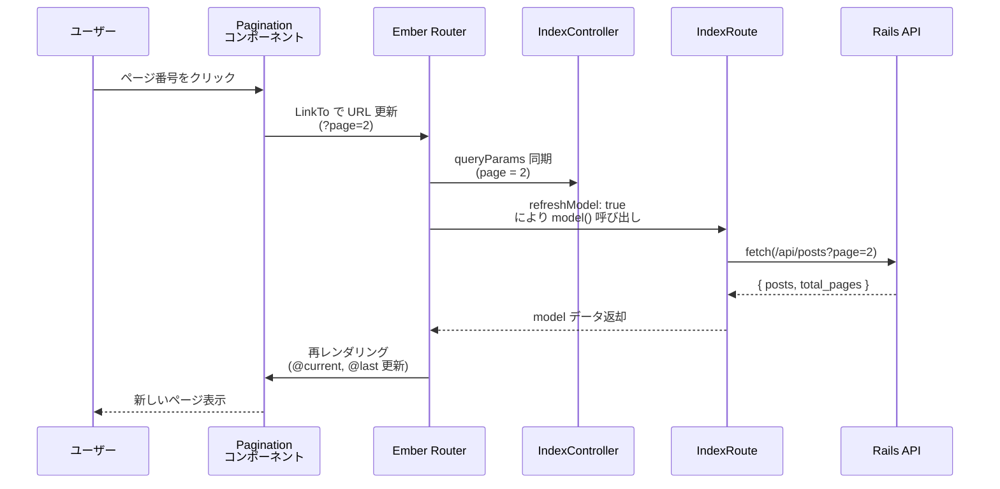
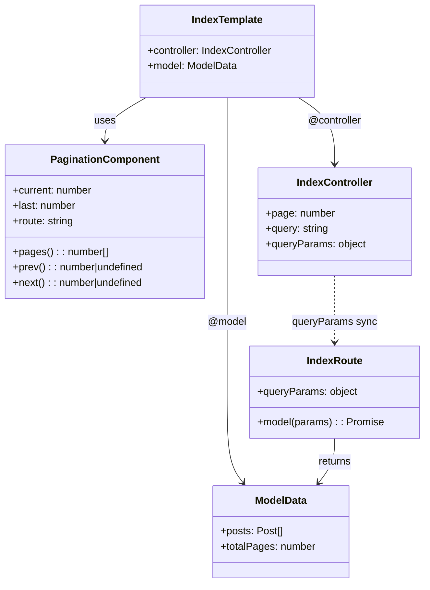

```mermaid
sequenceDiagram
      participant User as ユーザー
      participant Pagination as Pagination<br/>コンポーネント
      participant Router as Ember Router
      participant Controller as IndexController
      participant Route as IndexRoute
      participant API as Rails API

      User->>Pagination: ページ番号をクリック
      Pagination->>Router: LinkTo で URL 更新<br/>(?page=2)
      Router->>Controller: queryParams 同期<br/>(page = 2)
      Router->>Route: refreshModel: true<br/>により model() 呼び出し
      Route->>API: fetch(/api/posts?page=2)
      API-->>Route: { posts, total_pages }
      Route-->>Router: model データ返却
      Router->>Pagination: 再レンダリング<br/>(@current, @last 更新)
      Pagination-->>User: 新しいページ表示
```

```mermaid
classDiagram
      class PaginationComponent {
          +current: number
          +last: number
          +route: string
          +pages(): number[]
          +prev(): number|undefined
          +next(): number|undefined
      }

      class IndexController {
          +page: number
          +query: string
          +queryParams: object
      }

      class IndexRoute {
          +queryParams: object
          +model(params): Promise
      }
      class IndexTemplate {
          +controller: IndexController
          +model: ModelData
      }

      class ModelData {
          +posts: Post[]
          +totalPages: number
      }

      IndexTemplate --> PaginationComponent : uses
      IndexTemplate --> IndexController : @controller
      IndexTemplate --> ModelData : @model
      IndexRoute --> ModelData : returns
      IndexController ..> IndexRoute : queryParams sync
```
