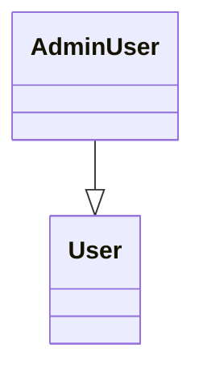

## クラス図の書き方

### 基本の書き方

```
classDiagram
    class User {}
    class AdminUser{}

    AdminUser --|> User
```


### 継承

```
classDiagram
    AdminUser --|> User
```

### 関連

```
classDiagram
    User --> Post
```

### 多重度

```
classDiagram
    User "1" --> "0..*" Post
```

| 表記 | 意味 |
|---|---|
| `1` | 1つ |
| `0..1` | あるかもしれない |
| `0..*` | 複数 |
| `1..*` | 1つ以上 |
