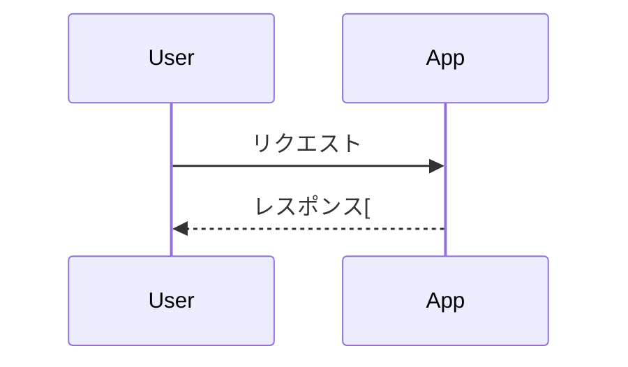
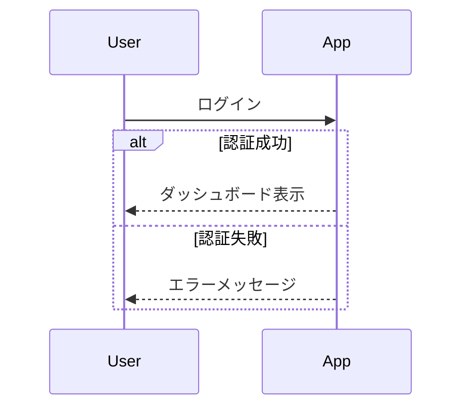
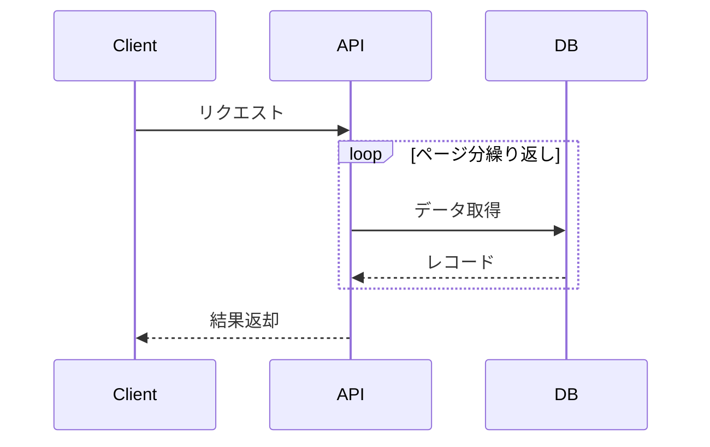
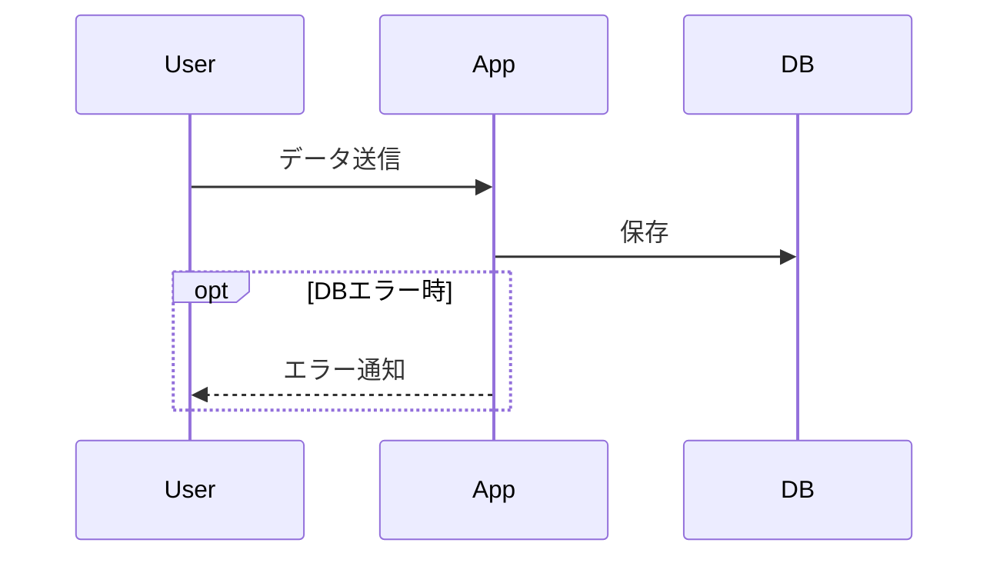
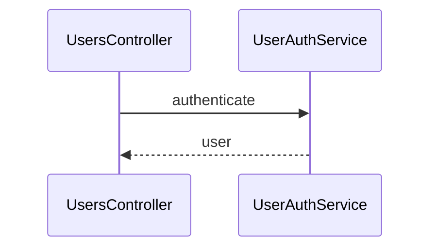
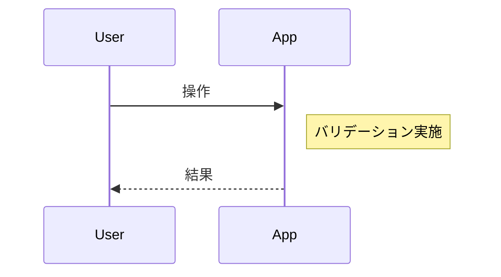

## シーケンス図の書き方

### 基本の書き方

```
sequenceDiagram
    participant User
    participant App

    User->>App: リクエスト
    App-->>User: レスポンス[
```



| 記法 | 意味 |
|---|---|
| `->>` | メソッド呼び出し |
| `-->>`| 戻り値 |
| `+`/ `-` | 処理中のライフライン強調 |

### 条件分岐

```
sequenceDiagram
    User->>App: ログイン
    alt 認証成功
        App-->>User: ダッシュボード表示
    else 認証失敗
        App-->>User: エラーメッセージ
    end
```



### 繰り返し

```
sequenceDiagram
    Client->>API: リクエスト
    loop ページ分繰り返し
        API->>DB: データ取得
        DB-->>API: レコード
    end
    API-->>Client: 結果返却
```



### 例外・エラー

```
sequenceDiagram
    User->>App: データ送信
    App->>DB: 保存
    opt DBエラー時
        App-->>User: エラー通知
    end
```



### participant の別名（長い名前対策）

```
sequenceDiagram
    participant C as UsersController
    participant S as UserAuthService

    C->>S: authenticate
    S-->>C: user
```



### 注釈

```
sequenceDiagram
    User->>App: 操作
    Note right of App: バリデーション実施
    App-->>User: 結果
```


