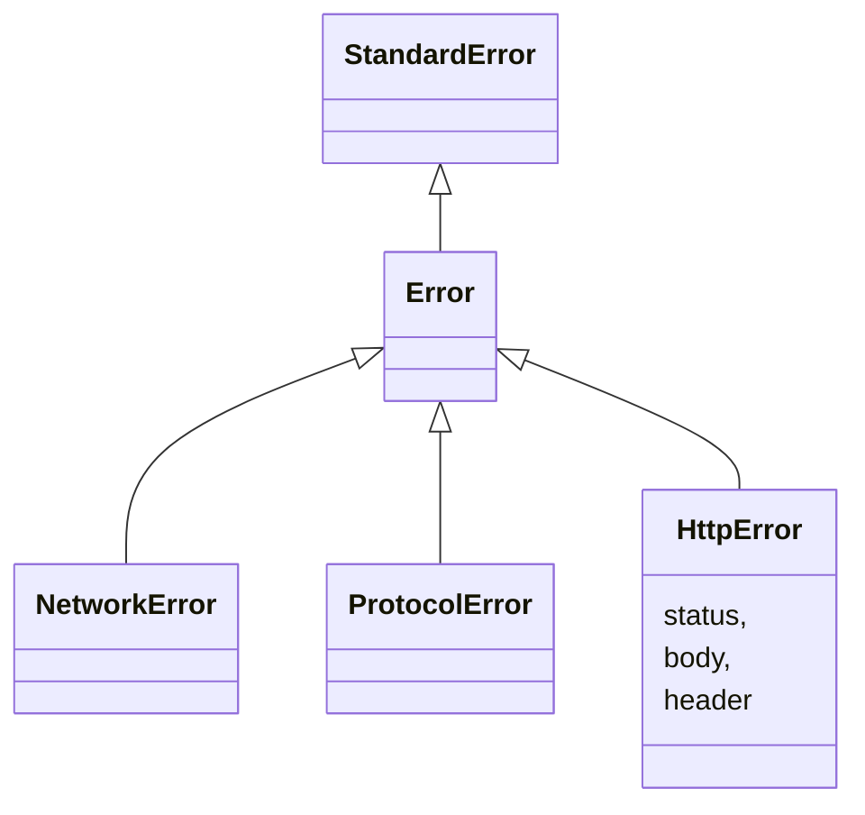

```ruby
count = 0
max_attempt = 3

begin
  # 例外発生
rescue ProtocolError => e
  # TODO
rescue NetworkError => e
  count += 1

  retry if count < max_attempt
  raise
rescue HttpError => e
  case e.status
  when 400
    # TODO
  when 500
    # TODO
  else
    # TODO
  end
rescue Error => e
  # TODO
end
```
